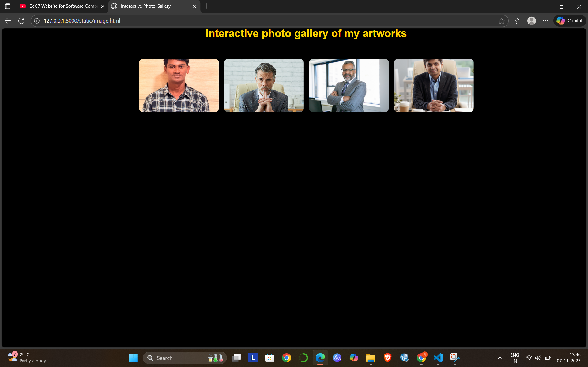

# Ex.08 Design of Interactive Image Gallery

## AIM
  To design a web application for an inteactive image gallery with minimum five images.

## DESIGN STEPS

## Step 1:

Clone the github repository and create Django admin interface

## Step 2:

Change settings.py file to allow request from all hosts.

## Step 3:

Use CSS for positioning and styling.

## Step 4:

Write JavaScript program for implementing interactivit

## Step 5:

Validate the HTML and CSS code

## Step 6:

Publish the website in the given URL.

## PROGRAM
```
<!DOCTYPE html>
<html>
<head>
  <meta charset="UTF-8" />
  <meta name="viewport" content="width=device-width, initial-scale=1.0"/>
  <title>Interactive Photo Gallery</title>
  <link rel="stylesheet" href="style.css"/>
</head>
<body>
  <div class="title">
    <h2>Interactive photo gallery of my artworks</h2>
  </div>
  <div class="gallery">
    
    
    
        
  </div>
  <div class="lightbox" id="lightbox">
    <button class="close" id="closeBtn">&times;</button>
    <button class="prev" id="prevBtn">&#10094;</button>
    
    <button class="next" id="nextBtn">&#10095;</button>
  </div>
  <style>
    h2{
      color: gold;
      text-align: center;
    }
    body {
  background: black;
  font-family: Arial, sans-serif;
}
.gallery {
  display: flex;
  flex-wrap: wrap;
  gap: 12px;
  padding: 24px;
  justify-content: center;
}
.gallery img {
  width: 180px;
  height: 120px;
  object-fit: cover;
  border-radius: 8px;
  cursor: pointer;
  box-shadow: 0 2px 8px rgba(0,0,0,0.12);
  transition: transform 0.2s;
}
.gallery img:hover {
  transform: scale(1.05);
}
.lightbox {
  display: none;
  position: fixed;
  inset: 0;
  justify-content: center;
  align-items: center;
  background: rgba(0,0,0,0.82);
  z-index: 1000;
  flex-direction: row;
}
.lightbox img {
  width: 60vw;
  max-width: 700px;
  height: auto;
  border-radius: 8px;
  box-shadow: 0 2px 20px rgba(0,0,0,0.18);
}
.lightbox .close,
.lightbox .prev,
.lightbox .next {
  position: absolute;
  background: #fff;
  border: none;
  cursor: pointer;
  font-size: 2rem;
  padding: 14px;
  border-radius: 50%;
  transition: background 0.2s;
  opacity: 0.9;
}
.lightbox .close { top: 20px; right: 30px; }
.lightbox .prev { left: 10vw; top: 50%; transform: translateY(-50%); }
.lightbox .next { right: 10vw; top: 50%; transform: translateY(-50%); }
.lightbox .close:hover,
.lightbox .prev:hover,
.lightbox .next:hover { background: #ffeeee; }


  </style>
  <script>
const galleryImages = document.querySelectorAll('.gallery img');
const lightbox = document.getElementById('lightbox');
const lightboxImg = document.getElementById('lightboxImg');
const closeBtn = document.getElementById('closeBtn');
const prevBtn = document.getElementById('prevBtn');
const nextBtn = document.getElementById('nextBtn');

let currentIndex = 0;

function showLightbox(idx) {
  currentIndex = idx;
  lightboxImg.src = galleryImages[currentIndex].src;
  lightbox.style.display = 'flex';
}

function hideLightbox() {
  lightbox.style.display = 'none';
}

function showPrev() {
  currentIndex = (currentIndex - 1 + galleryImages.length) % galleryImages.length;
  lightboxImg.src = galleryImages[currentIndex].src;
}

function showNext() {
  currentIndex = (currentIndex + 1) % galleryImages.length;
  lightboxImg.src = galleryImages[currentIndex].src;
}

galleryImages.forEach((img, idx) => {
  img.addEventListener('click', () => showLightbox(idx));
});

closeBtn.addEventListener('click', hideLightbox);
prevBtn.addEventListener('click', showPrev);
nextBtn.addEventListener('click', showNext);

lightbox.addEventListener('click', (e) => {
  if (e.target === lightbox) hideLightbox();
});

  </script>
</body>
</html>
```

## OUTPUT



## RESULT
  The program for designing an interactive image gallery using HTML, CSS and JavaScript is executed successfully.
